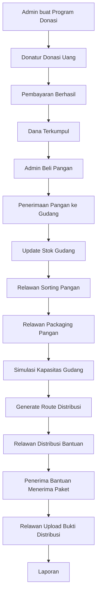

# Activity Diagram

```mermaid
flowchart TD
    A[Admin buat Program Donasi] --> B[Donatur Donasi Uang]
    B --> C[Pembayaran Berhasil]
    C --> D[Dana Terkumpul]
    D --> E[Admin Beli Pangan]
    E --> F[Penerimaan Pangan ke Gudang]
    F --> G[Update Stok Gudang]
    G --> H[Relawan Sorting Pangan]
    H --> I[Relawan Packaging Pangan]
    I --> J[Simulasi Kapasitas Gudang]
    J --> K[Generate Route Distribusi]
    K --> L[Relawan Distribusi Bantuan]
    L --> M[Penerima Bantuan Menerima Paket]
    M --> N[Relawan Upload Bukti Distribusi]
    N --> O[Laporan]
```

