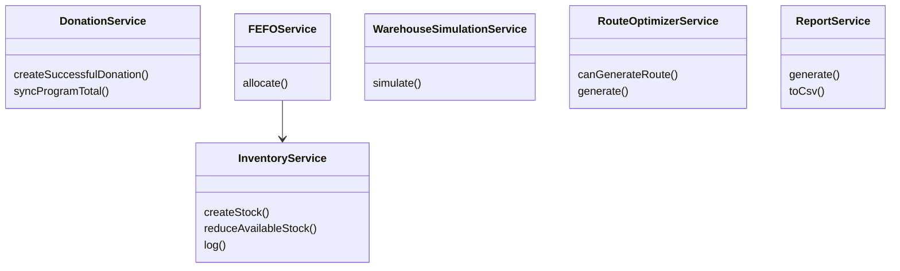

# Class Diagram

```mermaid
classDiagram
    class DonationService {
        createSuccessfulDonation()
        syncProgramTotal()
    }
    class InventoryService {
        createStock()
        reduceAvailableStock()
        log()
    }
    class FEFOService {
        allocate()
    }
    class WarehouseSimulationService {
        simulate()
    }
    class RouteOptimizerService {
        canGenerateRoute()
        generate()
    }
    class ReportService {
        generate()
        toCsv()
    }

    FEFOService --> InventoryService
```

