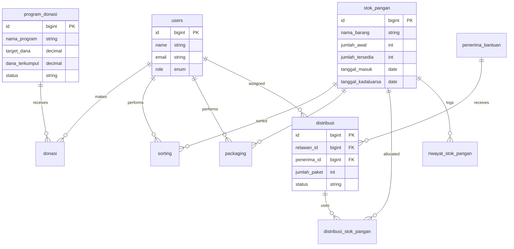

# ERD

```mermaid
erDiagram
    users ||--o{ donasi : makes
    users ||--o{ sorting : performs
    users ||--o{ packaging : performs
    users ||--o{ distribusi : assigned
    program_donasi ||--o{ donasi : receives
    stok_pangan ||--o{ sorting : sorted
    stok_pangan ||--o{ packaging : packaged
    stok_pangan ||--o{ distribusi_stok_pangan : allocated
    stok_pangan ||--o{ riwayat_stok_pangan : logs
    distribusi ||--o{ distribusi_stok_pangan : uses
    penerima_bantuan ||--o{ distribusi : receives

    users {
        id bigint PK
        name string
        email string
        role enum
    }

    program_donasi {
        id bigint PK
        nama_program string
        target_dana decimal
        dana_terkumpul decimal
        status string
    }

    stok_pangan {
        id bigint PK
        nama_barang string
        jumlah_awal int
        jumlah_tersedia int
        tanggal_masuk date
        tanggal_kadaluarsa date
    }

    distribusi {
        id bigint PK
        relawan_id bigint FK
        penerima_id bigint FK
        jumlah_paket int
        status string
    }
```

