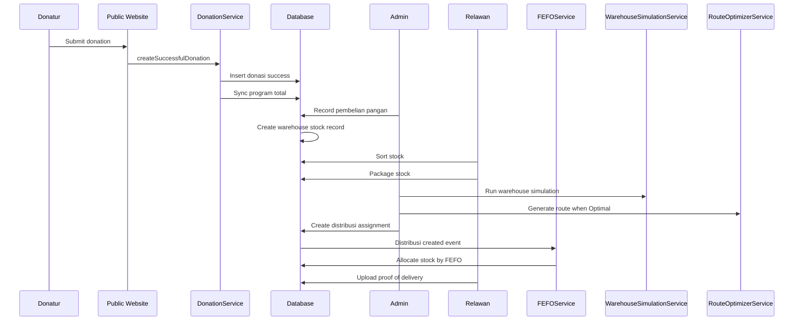

# Sequence Diagram

```mermaid
sequenceDiagram
    participant D as Donatur
    participant Web as Public Website
    participant DS as DonationService
    participant DB as Database
    participant A as Admin
    participant R as Relawan
    participant FS as FEFOService
    participant WS as WarehouseSimulationService
    participant RO as RouteOptimizerService

    D->>Web: Submit donation
    Web->>DS: createSuccessfulDonation
    DS->>DB: Insert donasi success
    DS->>DB: Sync program total
    A->>DB: Record pembelian pangan
    DB->>DB: Create warehouse stock record
    R->>DB: Sort stock
    R->>DB: Package stock
    A->>WS: Run warehouse simulation
    A->>RO: Generate route when Optimal
    A->>DB: Create distribusi assignment
    DB->>FS: Distribusi created event
    FS->>DB: Allocate stock by FEFO
    R->>DB: Upload proof of delivery
```

